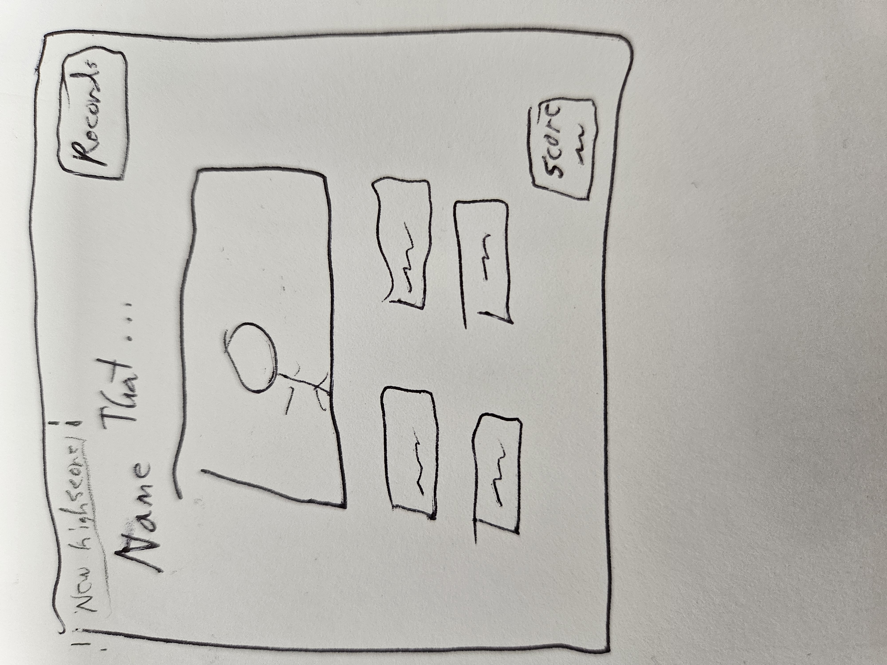
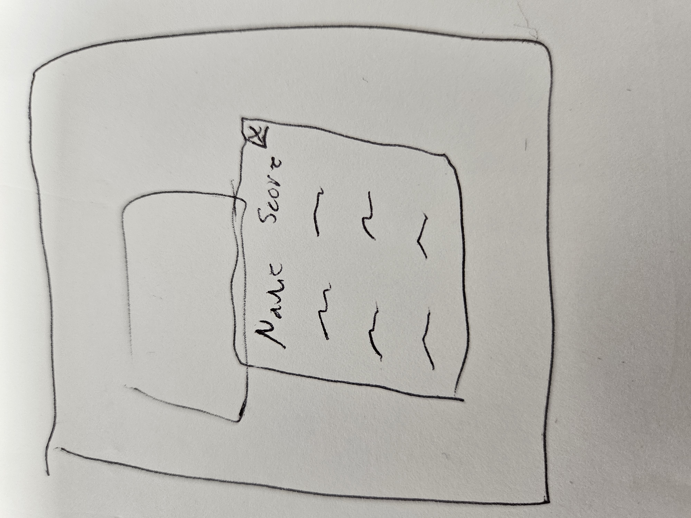
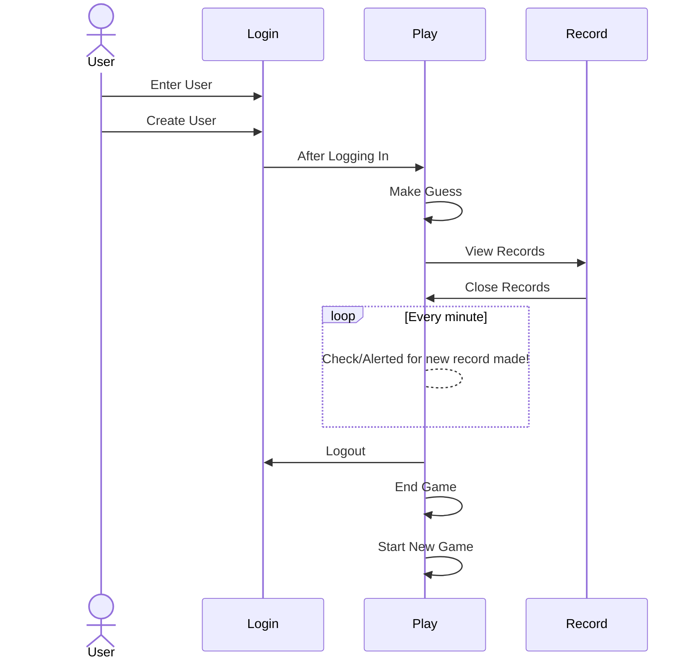

# Name That

## 🚀 Specification Deliverable

For this deliverable I did the following. I checked the box `[x]` and added a description for things I completed.

- [x] Proper use of Markdown
- [x] A concise and compelling elevator pitch
- [x] Description of key features
- [x] Description of how you will use each technology
- [x] One or more rough sketches of your application. Images must be embedded in this file using Markdown image references.

### Elevator pitch

RPH - Do you love naming animals at the zoo, actors on TV, or labeling those sweet cars that pass by? The Trivia app makes it so items come up and you test your memory in seeing how many you can correctly label. As each guess is made the user's guesses are tallied and displayed. Give it a go and set the new record.

### Design

### Key features

- Display question image
- Display of options
- Store final score
- Ability to select option
- Alert if a 1st was reached

### Technologies

I am going to use the required technologies in the following ways.

- **HTML** - 2 HTML pages. 1 for login (and possibly topic selection), and another for guessing items name. Giving the body and structure for both pages and their popups.
- **CSS** - Appropriate styling on separate pages. Whitespace and proper color choice included.
- **Javascript** -  Controls the Trivia engine. Allowing user to login, view high scores, and and make a guess for the current picture.
- **React** - Gives Login page, Trivia page, and React to combine components of each. 
- **Service** - Backend endpoints for:
   - logging in
   - creating a user
   - retrieve picture
   - retrieve options
   - submit guess
   - retrieve correct guess count/user
- **DB/Login** - Stores users, pictures, and options in the database. Register and login the correct user.
- **WebSocket** - Once a new highscore is made, realtime that highscore onto the record list for players playing at that moment.

## 🚀 AWS deliverable

For this deliverable I did the following. I checked the box `[x]` and added a description for things I completed.

- [x] **Server deployed and accessible with custom domain name** - [My server link](https://yourdomainnamehere.click).

## 🚀 HTML deliverable

For this deliverable I did the following. I checked the box `[x]` and added a description for things I completed.

- [x] **HTML pages** - I created a HTML page for each page of the APP
- [x] **Proper HTML element usage** - I choose the right element type per task (Header, body, link...)
- [x] **Links** - I included links, both for accessing each HTML page, and for the Github location.
- [x] **Text** - I place text on the screen. Also added comments to describe tasks
- [x] **3rd party API placeholder** - I added an element for the "3rd party API placeholder"
- [x] **Images** - I call and display a image within the app.
- [x] **Login placeholder** - I have a html representing upcoming Login elements
- [x] **DB data placeholder** - I have a data placeholder. holding where the picture and questions will be shown.
- [x] **WebSocket placeholder** - I have a placeholder for the websocket, storing and updating user high scores.

## 🚀 CSS deliverable

For this deliverable I did the following. I checked the box `[x]` and added a description for things I completed.

- [X] **Header, footer, and main content body** - I created separate Header, footer, main content for each page.
- [X] **Navigation elements** - I include nav link elements to reach other pages
- [X] **Responsive to window resizing** - I have elements respond to windows resizing
- [X] **Application elements** - I did not complete this part of the deliverable.
- [X] **Application text content** - I did not complete this part of the deliverable.
- [X] **Application images** - I include a message to dispay

## 🚀 React part 1: Routing deliverable 

For this deliverable I did the following. I checked the box `[x]` and added a description for things I completed.

- [X] **Bundled using Vite** - I added Vite to the project
- [X] **Components** - I converted the css of each component to jsx
- [X] **Router** - Routing between login and voting components.

## 🚀 React part 2: Reactivity

For this deliverable I did the following. I checked the box `[x]` and added a description for things I completed.

- [X] **All functionality implemented or mocked out** - I added interactivity between commands 
- [X] **Hooks** - Added "React.useState" to pass values between different pages/sub-pages. Added "React.useEffect" to also periodically alerting user a high score has been made.

## 🚀 Service deliverable

For this deliverable I did the following. I checked the box `[x]` and added a description for things I completed.

- [x] **Node.js/Express HTTP service** - I created the Express folder, installed Express tools, creating the default port to be 4000.
- [ ] **Static middleware for frontend** - I did not complete this part of the deliverable.
- [ ] **Calls to third party endpoints** - I did not complete this part of the deliverable.
- [x] **Backend service endpoints** - I Created endpoints in services index.js file for the logging on/off authentication
- [ ] **Frontend calls service endpoints** - The functionality calls to services endpoints to check work.

## 🚀 DB/Login deliverable

For this deliverable I did the following. I checked the box `[x]` and added a description for things I completed.

- [ ] **User registration** - I did not complete this part of the deliverable.
- [ ] **User login and logout** - I did not complete this part of the deliverable.
- [ ] **Stores data in MongoDB** - I did not complete this part of the deliverable.
- [ ] **Stores credentials in MongoDB** - I did not complete this part of the deliverable.
- [ ] **Restricts functionality based on authentication** - I did not complete this part of the deliverable.

## 🚀 WebSocket deliverable

For this deliverable I did the following. I checked the box `[x]` and added a description for things I completed.

- [ ] **Backend listens for WebSocket connection** - I did not complete this part of the deliverable.
- [ ] **Frontend makes WebSocket connection** - I did not complete this part of the deliverable.
- [ ] **Data sent over WebSocket connection** - I did not complete this part of the deliverable.
- [ ] **WebSocket data displayed** - I did not complete this part of the deliverable.
- [ ] **Application is fully functional** - I did not complete this part of the deliverable.
